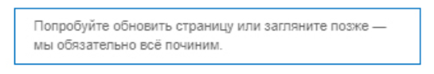
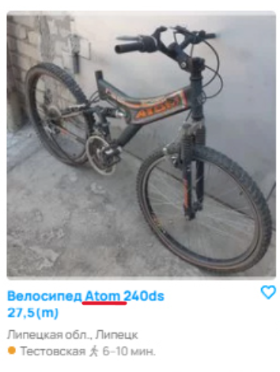
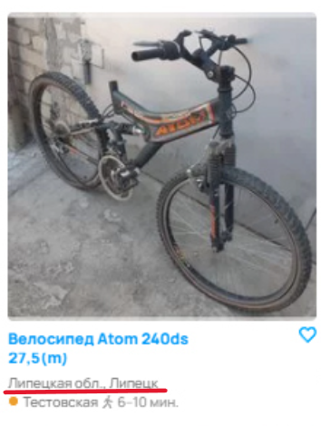
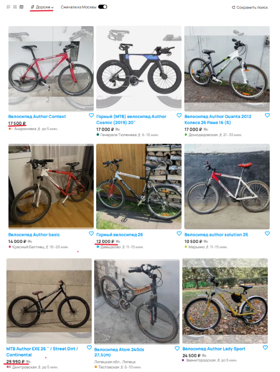
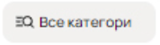
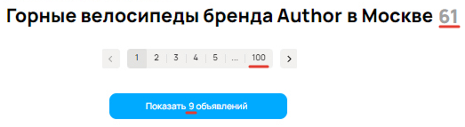
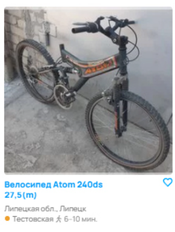
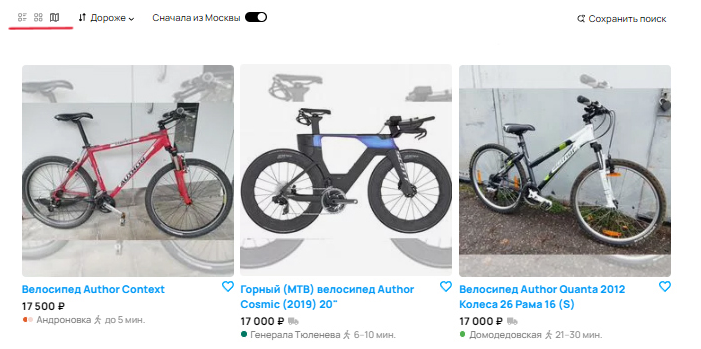
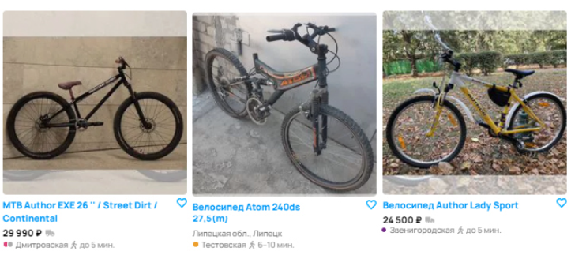

# Тестовое задание для стажёра QA-направления

## Задание 1

### Баг 1 – Некорректное сообщение об ошибке

#### Фактический результат:
В верхней части страницы отображается сообщение:
> *"Попробуйте обновить страницу или загляните позже — мы обязательно всё починим."*

При этом страница загружена корректно, объявления отображаются, функциональность поиска работает.

#### Ожидаемый результат:
Сообщение об ошибке должно появляться **только при реальной проблеме** с загрузкой контента.

#### Приоритет:
**Medium** – может ввести пользователя в заблуждение, но не мешает функционалу.

---

### Баг 2 – Некорректная работа фильтра по бренду

#### Фактический результат:
Выводятся велосипеды бренда Atom, несмотря на установленный фильтр по бренду Author.

#### Ожидаемый результат:
Должны отображаться только велосипеды бренда Author.

### Приоритет:
**High** – критическая ошибка в работе фильтра.

---

### Баг 3 – Некорректная работа фильтра по городу

#### Фактический результат:
На первой странице присутствует объявление из города Липецк, несмотря на установленный фильтр "Москва".

#### Ожидаемый результат:
Должны отображаться объявления только из выбранного города (Москва).

#### Приоритет:
**High** – критическая ошибка, влияющая на релевантность поиска.

---

### Баг 4 – Некорректная работа фильтра по типу велосипеда

#### Фактический результат:
Выводятся объявления с разными типами велосипедов, несмотря на установленный фильтр "Горные велосипеды".

#### Ожидаемый результат:
Должны отображаться только горные велосипеды.

#### Приоритет:
**High** – критическая ошибка в работе фильтра.

---

### Баг 5 – Ошибка в сортировке объявлений

#### Фактический результат:
При установленной сортировке "Дороже" объявления не отсортированы по убыванию цены. Первые позиции имеют цену 17000 ₽, далее 12000 ₽, затем 29000 ₽.

#### Ожидаемый результат:
Объявления должны сортироваться от самых дорогих к самым дешёвым.

#### Приоритет:
**High** – критическая ошибка, влияющая на пользовательский опыт.

---

### Баг 6 – Ошибка в отображении текста на кнопке

#### Фактический результат:
На кнопке отображается текст "Все категори" вместо "Все категории".

#### Ожидаемый результат:
Текст кнопки должен быть полностью виден: "Все категории".

#### Приоритет:
**Low** – косметическая ошибка.

---

### Баг 7 – Ошибка в навигации по страницам

#### Фактический результат:
В хлебных крошках навигации отсутствует название текущей страницы:
> "Главная > Хобби и отдых > Велосипеды >"

#### Ожидаемый результат:
Навигация должна содержать название текущей страницы:
> "Главная > Хобби и отдых > Велосипеды > Горные"

#### Приоритет:
**Low** – ошибка влияет на удобство навигации.

---

### Баг 8 – Несоответствие количества объявлений

#### Фактический результат:
Заголовок страницы сообщает, что найдено 61 объявление, но в блоке фильтрации указано "Показать 9 объявлений", а пагинация показывает 100 страниц.

#### Ожидаемый результат:
Должна отображаться корректная информация о количестве объявлений.

#### Приоритет:
**Low** – ошибка влияет на восприятие информации.

---

### Баг 9 – Отсутствие информации о цене

#### Фактический результат:
Некоторые объявления не содержат цены велосипеда.

#### Ожидаемый результат:
Если цена не указана, должна отображаться метка "Цена не указана".

#### Приоритет:
**Low** – не критично, но может вызывать путаницу у пользователей.

---

### Баг 10 – Ошибочное отображение объявлений

#### Фактический результат:
Объявления отображаются в плиточном виде, несмотря на установленный режим "С картой".

#### Ожидаемый результат:
Объявления должны отображаться в выбранном пользователем виде (с картой).

#### Приоритет:
**High** – ошибка, влияющая на пользовательский опыт.

---

### Баг 11 – Смещение карточки объявления

#### Фактический результат:
Одна из карточек объявления смещена вниз относительно остальных, что портит внешний вид страницы.

#### Ожидаемый результат:
Все карточки объявлений должны быть выровнены по одной линии.

#### Приоритет:
**Low** – косметическая ошибка, влияющая на визуальное восприятие.